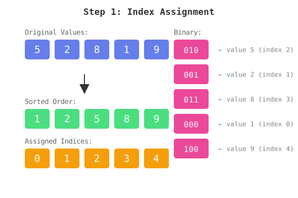

#


A sorting algorithm using two stacks and a limited set of operations. Part of the 42 school curriculum.

---

## 📋 Table of Contents
- [What is Push_Swap?](#what-is-push_swap)
- [Installation](#installation)
- [Usage](#usage)
- [Algorithm: Radix Sort Explained](#algorithm-radix-sort-explained)

---

## What is Push_Swap?

Sort integers using only **two stacks** (A and B) and specific operations. The goal: sort with the **minimum number of moves**.

**Features:**
- ✅ Handles any integers (positive, negative)
- ✅ Radix sort for large sets (100+ numbers)
- ✅ Optimized algorithms for small sets (2-5 numbers)
- ✅ Full input validation

---

## Installation

```bash
# Clone and compile
git clone <repo-url>
cd Push_Swap
make

# The executable 'push_swap' is created
```

---

## Usage

```bash
# Multiple arguments
./push_swap 5 2 8 1 9

# Single string
./push_swap "5 2 8 1 9"

# With negative numbers
./push_swap -42 0 13 -7 100

# Test with 100 random numbers
ARG=$(shuf -i 0-100 -n 100 | tr '\n' ' '); ./push_swap $ARG | wc -l
```

**Output:** A list of operations to sort the stack
```bash
$ ./push_swap 3 2 1
sa
rra
```

---

## Algorithm: Radix Sort Explained

### Step 1: Index Assignment

First, assign each number an **index** based on its position in sorted order:



**Example:** `[5, 2, 8, 1, 9]`
- Smallest (1) gets index **0** → binary `000`
- Second (2) gets index **1** → binary `001`
- Third (5) gets index **2** → binary `010`
- Fourth (8) gets index **3** → binary `011`
- Largest (9) gets index **4** → binary `100`

---

### Step 2: Sort by Bits (LSB to MSB)

Process each bit position from right to left:

**How it works:**
1. **Check bit 0 (rightmost)** for each number:
   - If bit is **0** → push to Stack B (`pb`)
   - If bit is **1** → rotate Stack A (`ra`)

2. **Push everything back** from B to A (`pa`)

3. **Repeat** for bit 1, bit 2, etc.

---

### Visual Example: Sorting `[5, 2, 8, 1, 9]`

```
Initial Stack (with indices):
Stack A          Binary
  2 (010)  →     010
  1 (001)  →     001
  3 (011)  →     011
  0 (000)  →     000
  4 (100)  →     100

════════════════════════════════════════
BIT 0 PROCESSING (rightmost bit):
════════════════════════════════════════

2 (010): bit 0 = 0 → pb to B
1 (001): bit 0 = 1 → ra
3 (011): bit 0 = 1 → ra
0 (000): bit 0 = 0 → pb to B
4 (100): bit 0 = 0 → pb to B

After bit 0:
Stack A          Stack B
  1 (001)          4 (100)
  3 (011)          0 (000)
                   2 (010)

Push all back (pa):
Stack A
  2 (010)
  0 (000)
  4 (100)
  1 (001)
  3 (011)

════════════════════════════════════════
BIT 1 PROCESSING:
════════════════════════════════════════

2 (010): bit 1 = 1 → ra
0 (000): bit 1 = 0 → pb to B
4 (100): bit 1 = 0 → pb to B
1 (001): bit 1 = 0 → pb to B
3 (011): bit 1 = 1 → ra

After bit 1 + pa:
Stack A
  0 (000)
  4 (100)
  1 (001)
  2 (010)
  3 (011)

════════════════════════════════════════
BIT 2 PROCESSING (leftmost bit):
════════════════════════════════════════

0 (000): bit 2 = 0 → pb to B
4 (100): bit 2 = 1 → ra
1 (001): bit 2 = 0 → pb to B
2 (010): bit 2 = 0 → pb to B
3 (011): bit 2 = 0 → pb to B

After bit 2 + pa:
Stack A (SORTED!)
  0 (000)  →  value: 1
  1 (001)  →  value: 2
  2 (010)  →  value: 5
  3 (011)  →  value: 8
  4 (100)  →  value: 9

✓ SORTED IN 3 ITERATIONS!
```

---

### Why This Works

**Radix sort** processes numbers digit by digit (or bit by bit). By sorting based on each bit position from least significant to most significant, numbers naturally fall into sorted order.

**Time Complexity:** O(n × k) where k = number of bits ≈ **O(n log n)**

---

## Project Structure

```
Push_Swap/
├── includes/push_swap.h       # Header file
├── src/
│   ├── radix_sort.c          # Radix sort implementation
│   ├── sort_five.c           # Small stack optimizations (2-5)
│   ├── parsing.c             # Input validation
│   ├── stack_operation.c     # Basic stack ops
│   ├── a_oper.c / b_oper.c  # Stack A/B operations
│   └── ...
└── main.c                    # Entry point
```

---

## Input Validation

✅ **Valid:**
- `./push_swap 1 2 3`
- `./push_swap -5 -10 0`
- `./push_swap "42 13 -7"`

❌ **Invalid (prints "Error"):**
- Duplicates: `1 2 2 3`
- Non-numbers: `1 abc 3`
- Out of range: `2147483648`
- Empty strings

---

## Author

**akoaik** - 42 School

---

## Clean Up

```bash
make clean   # Remove .o files
make fclean  # Remove .o and executable
make re      # Rebuild
```
